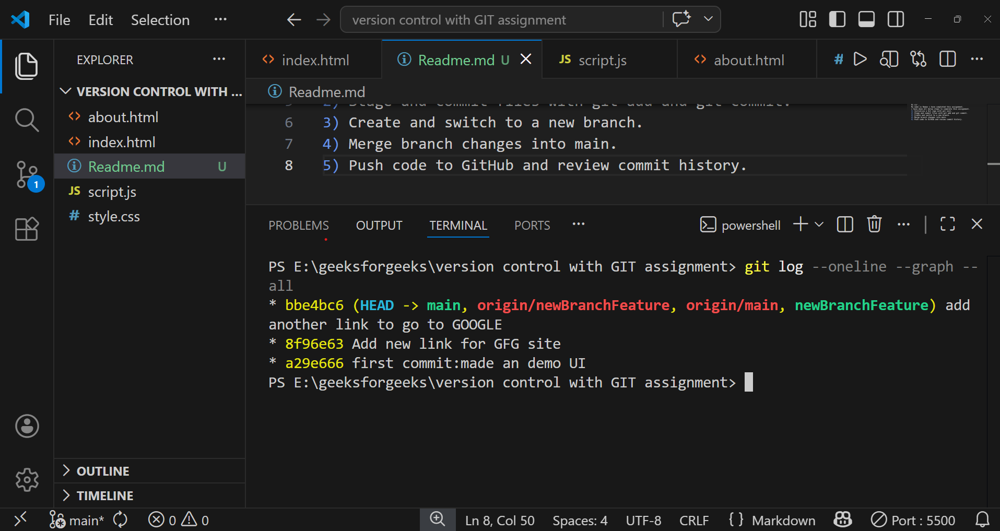

Hi sir ,
My name is Naman i have completed this assignment.
i have done all below steps to complete this assignment.
1) Initialize a Git repo with git init.
2) Stage and commit files with git add and git commit.
3) Create and switch to a new branch.
4) Merge branch changes into main.
5) Push code to GitHub and review commit history.

